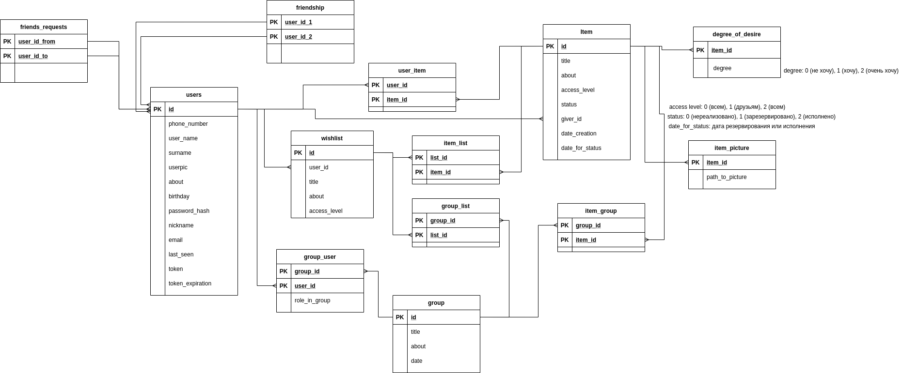

# Техническое задание
### 1. Тема
Веб-приложение «Wishlist – список желаний».

### 2. Словесное описание предметной области и актуальность
    
Часто случается, что на день рождения, другой праздник или мероприятие мы получает в подарок не то,
что хотели или один и тот же подарок в нескольких экземплярах. Данное приложение позволит решить данную проблему.

### 3. Описание данных, хранящихся в БД
БД должна хранить следующие данные:
* Зарегистрированные в системе пользователи;
* Списки желаний, созданные пользователем; 
* Предметы в каждом списке желаний и описание, предоставленное пользователем по данному предмету;
* Групповые списки желаний для праздников;
* Информацию о том, кто выбрал подарок, который будет дарить;

### 4. Роли пользователей приложения

* Незарегистрированные пользователи;
* Пользователь, создающий список(-ки) желаний;
* Пользователь, просматривающий чужие списки желаний.

### 5. Развернутое описание функционала приложения для каждой из ролей
##### a)	Незарегистрированные пользователи:
Незарегистрированные в системе пользователи могут лишь просматривать открытые списки желаний, созданные зарегистрированным пользователем. В системе можно зарегистрироваться по номеру телефона.

##### b)	Зарегистрированному пользователю, создающему список(-ки) желаний доступно:
* Редактировать информацию о себе;
* Создавать списки;
* Давать уровни доступа списку: открытые (для незарегистрированных пользователей только просмотр, для зарегистрированных – просмотр и выбор подарка) или приватный (доступен только автору списка);
* Создавать групповые списки желаний и приглашать туда остальных пользователей (в дальнейшем групповые списки доступны для просмотра только пользователям, состоящим в своих группах).

##### c)	Зарегистрированному пользователю, просматривающему чужие списки желаний доступно:
* Просматривать профили друзей, их открытые списки желаний;
* Выбирать, что собирается дарить;
* Просматривать групповые списки, в которых он состоит.

Отдельно стоит рассмотреть групповые списки.
В групповых списках присутствуют несколько ролей: «даритель» (тот, кто дарит), 
«виновник торжества» (кто принимает), друзья (одновременно и дарит, и принимает подарок). 
Например, на свадьбе виновниками торжества являются новобрачные и дарители – приглашенные гости, 
а на Новый Год все друг другу дарят подарки, поэтому у всех пользователей будет роль «друзья».

### 6. Схема базы данных ИС

### 7. Срок предоставления курсовой работы
25.12.2020
